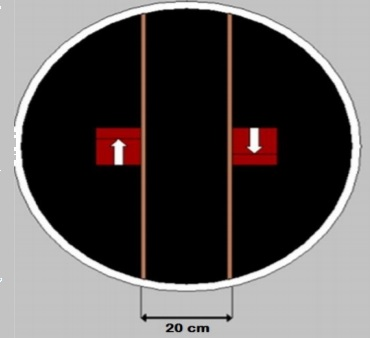
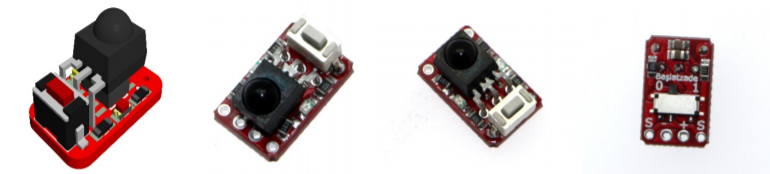

# Robokan'19 Mini Sumo Robotu Kategorisi Kuralları

### Diğer kategorilerde olduğu gibi Mini Sumo Robotu Kategorisinde de Genel Kurallar geçerlidir.

### Yarışmanın Amacı
Robotlar belirtilen süre içerisinde birbirlerini, belirtilen dohyo alanı kuralları çerçevesinde alan dışına atmaya çalışmaktadır.

1. Kategori Kuralları  
	1. Yarışma esnasında robotu 1 kişi kullanacaktır. Robotlar otonom olacaktır. Yarışma esnasında robotlara dışarıdan müdahale edilemez ve cihazla uzaktan kontrol edilemez. 
	2. Robotlar, bilgisayar programındaki kuraya göre eşleştirilirler. Aynı ekiplerin robotlarının birbirleriyle eşleşme durumları mümkündür. Bu konuda herhangi bir itiraz kabul edilmeyecektir. Kura sonuçları yayınlandıktan sonra değişimi mümkün değildir. 
	3. Belirsizlik durumunda hakemlerin kararı geçerlidir. 
	4. Karşılaşma esnasında koruyucu gözlük ve eldiven kullanılması gerekmektedir. 
2. Dohyo Alanı Kuralları  
	1. Mini Sumo Robot dohyosu zeminden 5 cm yüksekliğinde 75 cm çapında MDF’den üzerinde mat siyah zeminden oluşturulmuş dairedir.  
	2. Mini Sumo Robot dohyosunun kenarında alanı sınırlandırılmak için 2,5cm’lik beyaz çizgi mevcuttur. Bu çizgi dohyo alanı içinde olarak kabul edilir. 
	3. Yarışma sırasında robot ile birlikte alana gelen yarışmacı, Okan Üniversitesi Mekatronik Kulübü tarafından belirtilen alanın dışında durmalıdır. 
3. Robotların Teknik Donanım Kuralları  
	1. Mini Sumo Robotlar 10x10cm tabanına sahip, bir gerçek dikdörtgenler prizması içerisine sığabilmelidir. (Boyutta hata payı %2’dir) (2mm)
	2. Yükseklik sınırı yoktur. 
	3. Robotlar otonom olacaktır. Başlama ve durdurma dışında hiçbir şekilde uzaktan bir cihazla kontrol edilmeyeceklerdir. 
	4. Ağırlık sınırı 500 g’dir. %2’lik hata payı vardır. (10 gr) 
	5. Boyutlar karşılaşma başladıktan sonra değişebilir. 
4. Robotların Dohyoya Yerleşim Koşulları  

      

	1. Her robot kendi grubundaki diğer robotlarla raunt usulü maç yapacaktır. Zemine ilk değen robot kaybeder. Her raunt en fazla 2 dakikadır ve 2 dakikalık süre robotların çalıştırıldığı anda başlar. 2 raundu alan robot maçı kazanır. 3 raunt sonunda eşitlik bozulmamışsa  maçın galibi robotların ağırlığına göre (hafif olan robot) belirlenir.  
	2. Hakem robotun karşılaşmaya hazırlanması için işareti verdikten itibaren 4 dakika içinde ringe gelmeyen robot hükmen yenik sayılır.  
	3. Hakem hazırlık için işaret verdikten sonra yarışmacılar robotlarını dohyoya şekilde görüldüğü gibi kahverengi çizgiyi (Bu çizgi pistte hayali olarak varsayılacaktır) geçmeyecek şekilde yerleştirmek için hazır olmalıdırlar. Hakemin robotları yerleştirin işareti ile yarışmacılar aynı anda robotlarını kural dahilinde istedikleri yere yerleştirebilirler.(Örneğin üst taraftaki görselde gösterildiği gibi)
	4. Dohyoya yerleştirilen robotun yeri sonradan değiştirilemez. Robotların sonradan yerlerinin değiştirilmesi diskalifiye sebebidir. 
5. Robotların Yapımındaki Yasak Maddeler  
	1. Çalışma dalga boyunu (frekansını) etkileyen, rakibin çalışmasını etkileyen (flaşör, ışık gibi) her türlü parça yasaklanmıştır. 
	2. Robotlar insanlara, rakip robota ve dohyoya kasıtlı şekilde zarar veremezler. (Yarışma sırasındaki çarpışmalardan dolayı meydana gelen hasarlar sayılmayacaktır.) 
	3. Rakibe karşı saldırı mekanizması ya da silah olarak kullanılmak üzere sıvı, gaz ya da tozlar yasaktır. 
 
	4. Yanıcı maddeler robota takılamaz.
	5. Robotlarda kullanılan bataryalar rakip robota, piste ya da kendisine zarar vermeyecek 
şekilde yerleştirilmelidir. 
 
	6. Robota herhangi bir atıcı cihaz eklenemez. 
	7. Dohyonun yüzeyine kendini sabitleyen ve hareket etmesini engelleyen hiçbir parça 
robota takılmaz. (örneğin emici vakum, yapıştırıcı vb.) 
6. Oyunun İlkeleri  
	1. Robotlar rakipleri ile raunt usulü maç yaparlar. Rauntlar 2 dakikadan oluşmaktadır, 2 dakikalık süre robotların çalıştırıldığı anda başlar. Bu süre pistten ilk çıkan robot yenik sayılır. 
 
	2. 2 raundu alan robot maçı kazanır. Eşitlik durumunda 1 raunt daha yapılır. Eşitlik hala devam ediyorsa, robotun özellikleri (hafif olan robot) göz önünde bulundurularak hakem kararına göre kazanan belirlenir. 
 
	3. Robotların eşitlik durumlarının tanımlanması şu şekildedir: (Karşılaşmanın tekrar edilmesi başlığı altında da bu durumlar izah edilmiştir)  
		1. Robotların oyun içinde belirtilen süre zarfında birbirlerine takılı kalması ve hareketlerinin olmaması durumu. 
		2. Her iki robotunda dohyo dışına aynı anda çıkma durumu. 
 
		3. Robotların başladıktan sonra 10 saniye içerisinde hareket etmemesi durumu. 
 
		4. Robotlar raunt süresi boyunca birbirlerine karşı üstünlük sağlayamazsa, o raunt 
tekrar edilir. 
 
	4. İki robot arasındaki karşılaşma sonlanmadan robotlara her türlü bakım ve müdahale yasaktır. (Ancak raunt arasında 3 dakikalık teknik müdahale serbesttir. 3 dakikalık teknik mola sonunda yarış alanına gelmeyen takımlar yenik sayılır. Yarışmacılar, tüm yarışlar boyunca teknik mola hakkını 3 kez kullanabilirler. Finale kalan yarışmacılar teknik mola hakları bitmiş olsa dahi 1 kez daha teknik mola hakkını kullanabilirler)
	5. Robotlar, anons edildikten sonra 3 dakika içinde yarışmaya gelmezse, tarafların anlaşamaması durumunda diskalifiye edilirler. 
	6. Robotun herhangi bir yeri dohyo dışına değerse robot o raunt için yenik sayılır. Hakem iki robotun aynı anda dohyo dışına temas ettiğine karar verirse raunt tekrarlanır. 
	7. Robot dohyo dışına çıktığı halde zemine değmiyorsa karşılaşma devam eder. 
	8. Robot yere parça düşürürse, düşen parça rakibi engellemediği takdirde yarışmaya devam edilir. Fakat hakem parçanın rakibi engellediği kararına varırsa parça düşüren robot raundu kaybeder. 
	(Hakem kararına göre karar verilecektir) 
	9. Robotun çalışır durumda olduğunun anlaşılabilmesi için hakemin başlama işaretinden 
sonra 10 saniye içinde hareket etmelidir. Bu süre içinde hareketsiz kalırsa raunt tekrar edilir. Bu rauntta da aynı durum tekrarlanırsa raundu kaybeder. 
 
	10. Yarışma alanını (dohyoyu) tamamen terk eden ilk robot o raundu kaybetmiş sayılır. 
7. Karşılaşmanın Başlaması  
	1. Hakemler dohyoların durumlarını kontrol ettikten sonra karşılaşmaların başlamasına onay vereceklerdir. Eğer dohyo üzerinde çizik ya da kir olursa hakemler bu dohyonun kullanılıp kullanılmayacağına karar vereceklerdir.  
	2. Karşılaşma, hakem işareti ile yarışmacıların robotlarını başlama konumlarına aynı anda koymasıyla başlayacaktır. (Başlama konumları robotların dohyoya yerleşim koşullarında belirtilmiştir) 
	3. Robotlar yerleştirildikten sonra hareket ettirilmelerine izin verilmez. 
	4. Robotların yarışmaya başlaması ve bitirmesi, hakem tarafından kontrol edilen modül aracılığıyla olacaktır. Modül ile ilgili teknik bilgiler dosyanın en altında belirtilmiştir. 
	5. Karşılaşmalar sırasında, teknik konulardaki anlaşmazlıklarda, hakemlerin kararları 
geçerlidir. Kararlara itiraz konusunda, yalnızca yazılı dilekçeler dikkate alınacaktır. Dilekçeler organizasyon komitesine teslim edilecektir. Komite, her saat başı toplanacak ve kendisine verilen dilekçeleri değerlendirecektir. İlgili kararları, bir daha itiraz kabul etmeme üzere, katılımcılara en kısa zamanda bildirecektir. 
8. Karşılaşmanın Bitirilmesi  
	1. Yarışma resmi olarak hakemin duyurusuyla sona erecektir. 
	2. Yarışmacılar kendilerine belirlenen alandan hareket ederek robotlarını dohyo üzerinden veya dışından alacaklardır. 
 
9. Bir Karşılaşmanın Tekrar Başlatması  
	1. Her iki robot birbirlerine takılıp kalır ve sonraki hareketler mümkün olmaz ise 10 saniye sonunda hakem kararı ile raunt tekrarlanır. 
	2. Her iki robot aynı anda dohyonun dışına düşerse. 
	3. Robotlar karşılaşmaya başlar ve 10 saniye içerisinde hareketsizkalırsa.
10. Diskalifiye Kararı  
	1. Yasaklı durumlar hakemler tarafından tespit edilirse diskalifiye sebebidir.  
	2. Yarışmacı oyunu sabote ederse. (Örneğin kasıtlı olarak dohyoya hasar vermek, bozmak, 
kırmak) 
	3. Yarışma esnasında istemeden de olsa dohyoyu kazımak, boyayı sökmek yasaktır. 
	4. Eğer robottan alev çıkar ve yarışmaya devam edemez duruma gelirse.  
	birbirlerine takılıp kalır ve sonraki hareketler mümkün olmaz ise 10 saniye sonunda hakem kararı ile raunt tekrarlanır. 	5. Otonom olma şartlarını gerçekleştiremezse. 
	6. Yarışmacı sportmenlik dışı davranışlar gösterirse. Örneğin saldırgan bir dil kullanırsa, 
rakibe ve hakeme saldırırsa. 
	7. Yarışmacı kasıtlı olarak rakibine ve/veya rakibin robotuna zarar verirse. 

### Sumo robotlarda kullanılacak Başlatma/Durdurma devresi teknik özellikleri aşağıdaki gibi olacaktır.  

Teknik Özellikler: 

- 1 adet lojik pin kullanarak robotlarınız ile haberleşir. 
- Başlatma komutunu aldığında lojik 0 veya 1 sinyali verir. 
- Besleme gerilimi: 3.3V – 5V  
- Kart Boyutları: 8mm x 15mm x 7mm (En Ufak Boyutlu Başlatma Modülüdür) 
- Modülün altında bulunan anahtar sayesinde istediğiniz lojik çıkışı seçerek, 1 yada 0 çıkışı alabilirsiniz. (Bu özelliği sayesinde Dünya'daki tüm robot yarışmaları için uygundur) 

> Başlatma Modülü ile ilgili daha detaylı bilgi için aşağıdaki linki ziyaret edebilirsiniz:  
> http://www.robotzade.com/BaslatZade-Meb-Baslatma-Modulu,PR-1370.html 

> Okan Üniversitesi Mekatronik Kulübü, herhangi bir gerekçe vermeden gerektiğinde kurallarda değişiklik yapma hakkını saklı tutar.

